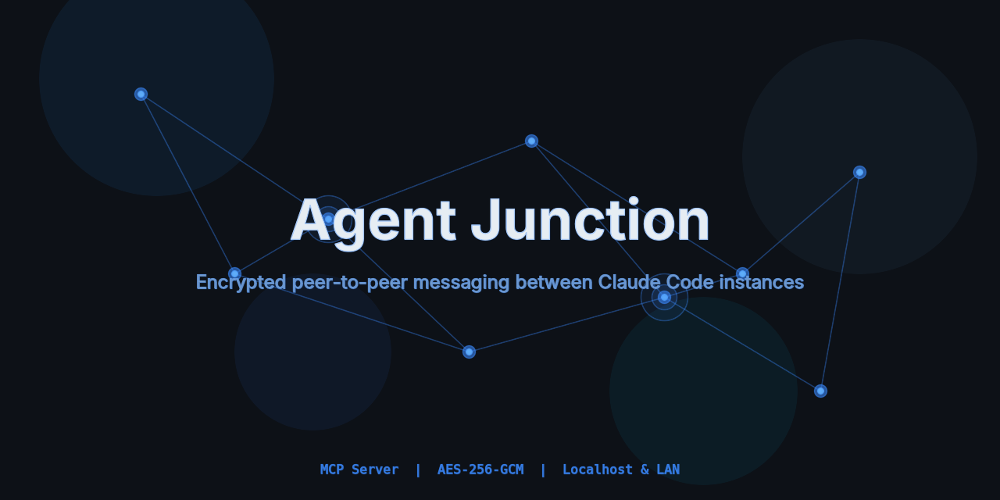

# Agent Junction

[](https://www.npmjs.com/package/agent-junction)

An MCP server that lets Claude Code instances communicate directly via an ephemeral, encrypted peer-to-peer message bus. Works on localhost or across your LAN.

## Install

```bash
npm install -g agent-junction
```

## The Problem

Multiple Claude Code sessions often have information the other needs — config paths, secrets, environment variables. Currently the human must manually relay this. Agent Junction eliminates that bottleneck.

## How It Works

1. Start the Junction server on one machine
2. Each Claude Code instance connects via MCP and gets a human-readable alias (e.g. `crimson-falcon`)
3. Agents discover each other with `list_peers` and exchange encrypted messages
4. Messages are encrypted with AES-256-GCM, read-once (deleted after reading), and purged on disconnect

## Quick Start

### 1. Start the server

```bash
# Run directly with npx (no install needed)
npx agent-junction

# Or if installed globally
agent-junction
```

### 2. Add to Claude Code

Add the following to your Claude Code MCP config (`~/.claude/settings.json` or project-level `.mcp.json`):

```json
{
  "mcpServers": {
    "junction": {
      "type": "streamable-http",
      "url": "http://127.0.0.1:4200/mcp"
    }
  }
}
```

Each Claude Code instance that should communicate needs this config. The server must be running before the instances connect.

### 3. From source (alternative)

```bash
git clone https://github.com/danielrosehill/Agent-Junction.git
cd Agent-Junction
npm install
npm run build
npm start
```

## Tools

| Tool | Description |
|------|-------------|
| `register` | Join the Junction, get your alias |
| `list_peers` | See who else is connected |
| `send_message` | Send an encrypted message to a peer by alias |
| `read_messages` | Read and clear your inbox (destructive read) |
| `known_hosts` | List pre-configured LAN hosts running Junction |
| `disconnect` | Leave, zero encryption keys, purge all data |

## Modes

### Localhost (default)

Binds to `127.0.0.1` — only instances on this machine can connect.

```bash
npm start
```

### LAN

Binds to `0.0.0.0` — instances on other machines can connect over the local network.

```bash
JUNCTION_HOST=0.0.0.0 npm start
```

Remote Claude Code instances connect by pointing their MCP config at the server's LAN IP:

```json
{
  "mcpServers": {
    "junction": {
      "type": "streamable-http",
      "url": "http://10.0.0.6:4200/mcp"
    }
  }
}
```

### Known Hosts

Define named LAN machines so agents can discover them with the `known_hosts` tool:

```bash
JUNCTION_KNOWN_HOSTS="workstation=10.0.0.6,vm=10.0.0.4,nas=10.0.0.50:4200" npm start
```

## Configuration

| Variable | Default | Description |
|----------|---------|-------------|
| `JUNCTION_HOST` | `127.0.0.1` | Bind address (`0.0.0.0` for LAN) |
| `JUNCTION_PORT` | `4200` | HTTP port |
| `JUNCTION_SESSION_TIMEOUT_MS` | `1800000` | Idle session expiry (30 min) |
| `JUNCTION_SWEEP_INTERVAL_MS` | `60000` | Expiry check interval |
| `JUNCTION_KNOWN_HOSTS` | *(empty)* | Comma-separated `name=ip` or `name=ip:port` |

## Security Model

- **AES-256-GCM** encryption with per-session keys and random IVs
- **Destructive reads** — messages deleted after reading
- **Key zeroing** — encryption keys overwritten with `0x00` on disconnect
- **Auto-expiry** — idle sessions purged after timeout
- **Ephemeral** — all state in-memory, nothing persists to disk
- **Localhost default** — LAN mode is opt-in

## Health Check

```bash
curl http://127.0.0.1:4200/health
# {"status":"ok","mode":"localhost","activePeers":2,"uptime":3600}
```

## Architecture

See [`planning/`](planning/) for the full specification and Mermaid architecture diagrams.

## License

MIT
