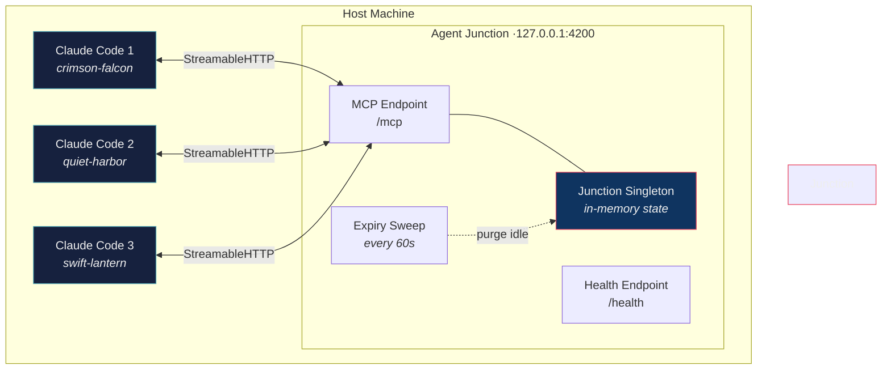
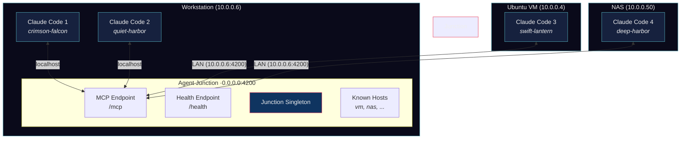
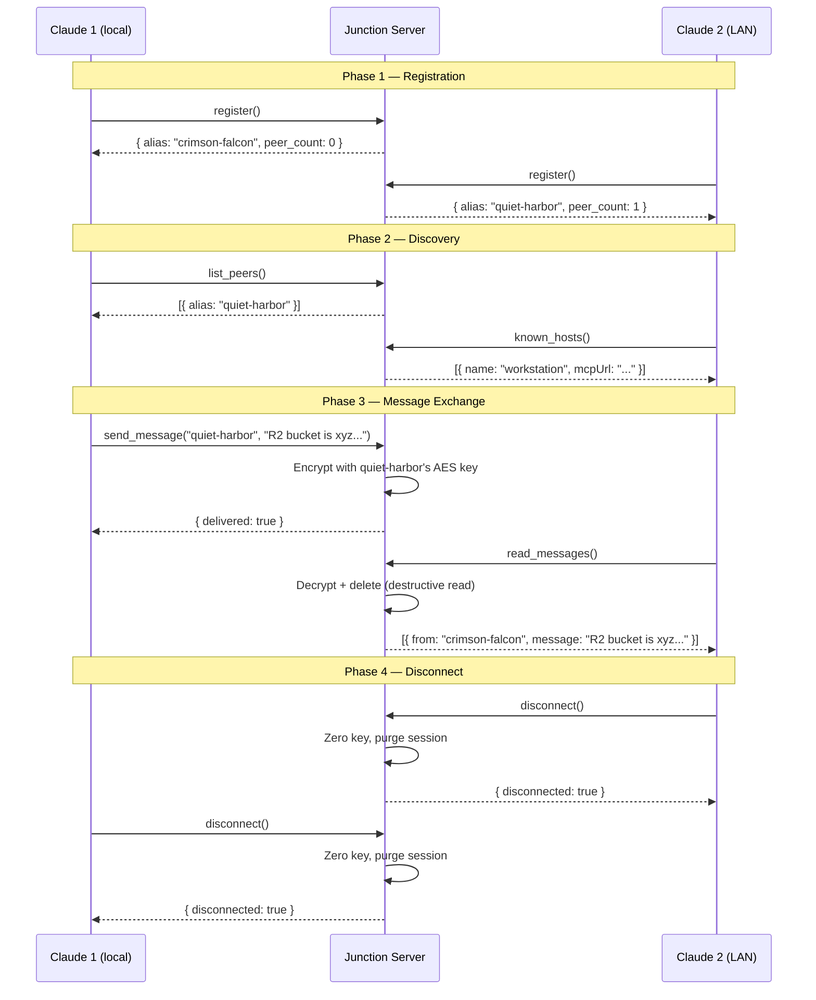
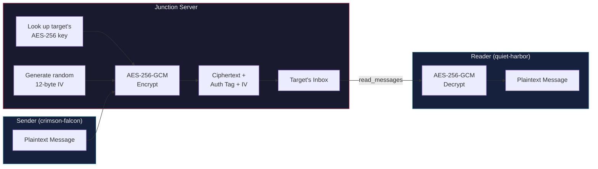
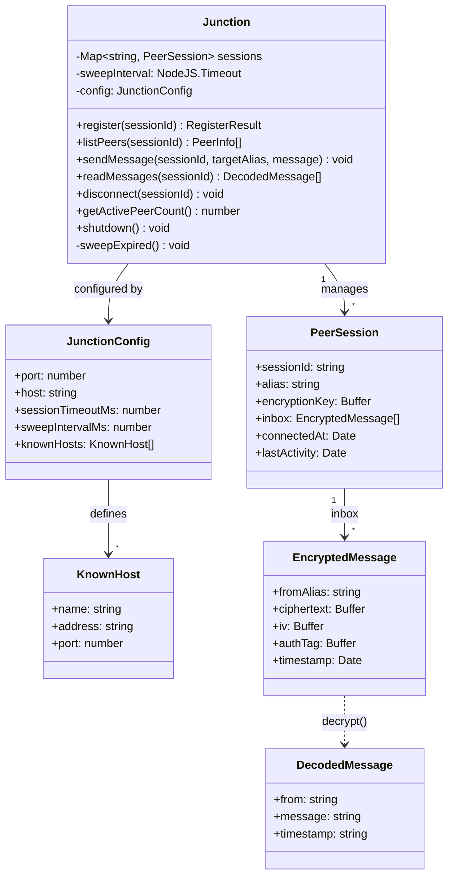
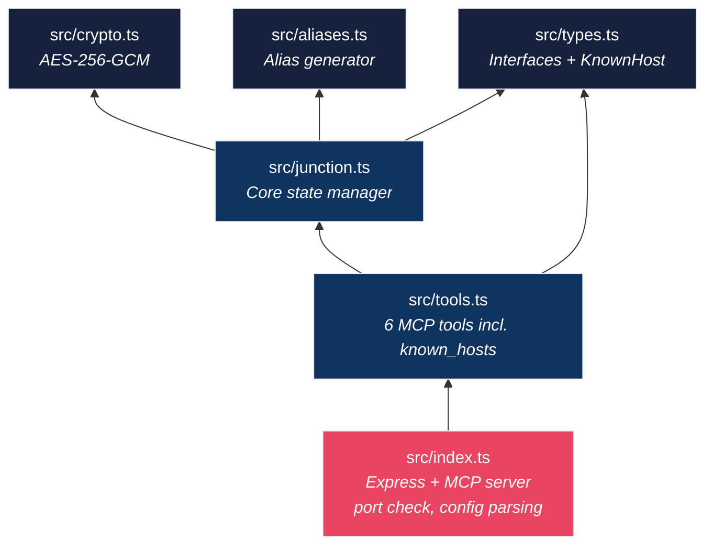
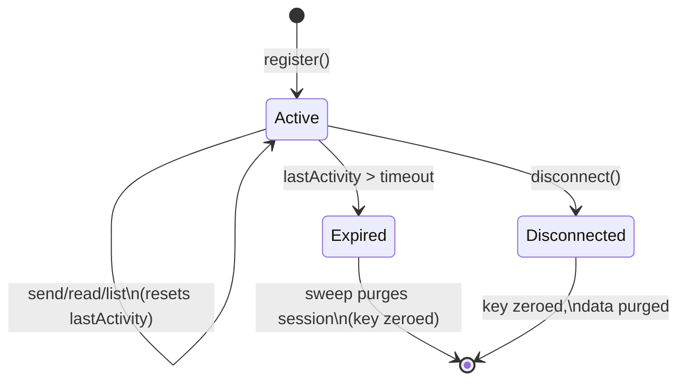
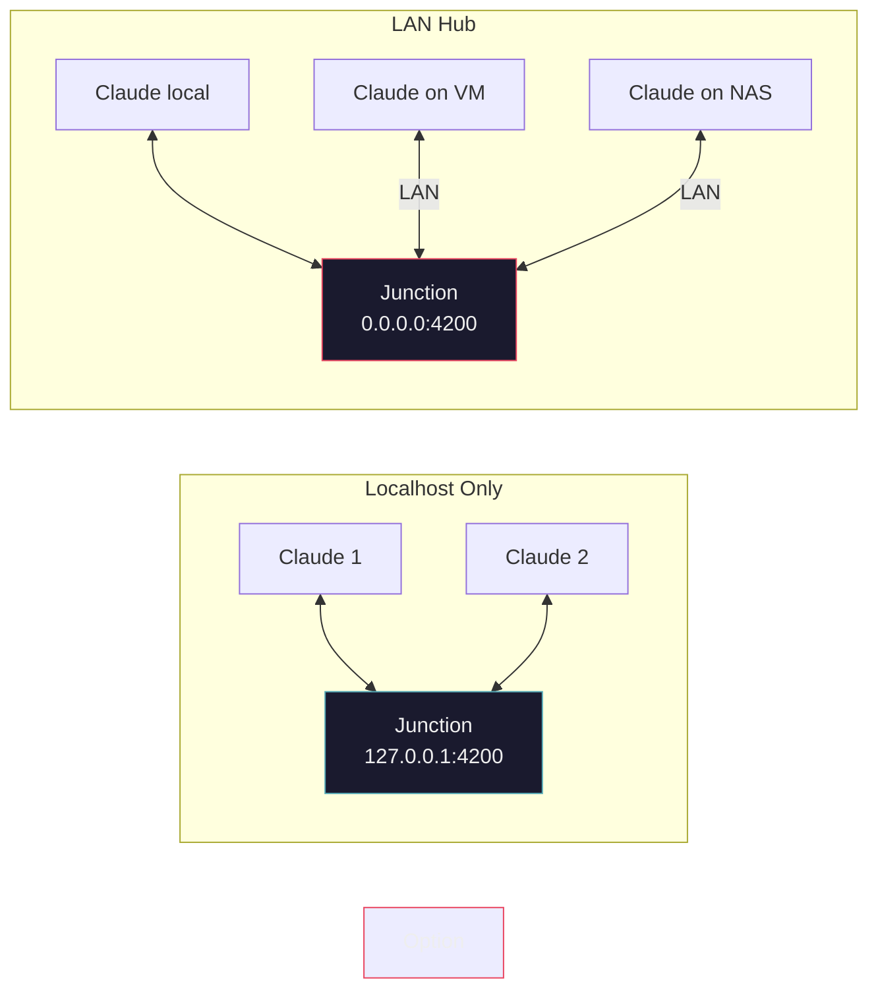

# Agent Junction — Architecture Diagrams

## System Overview (Localhost Mode)

## System Overview (LAN Mode)

## Session Lifecycle

## Encryption Flow

## Internal Data Model

## Module Dependency Graph

## Auto-Expiry Mechanism

## Deployment Topology

